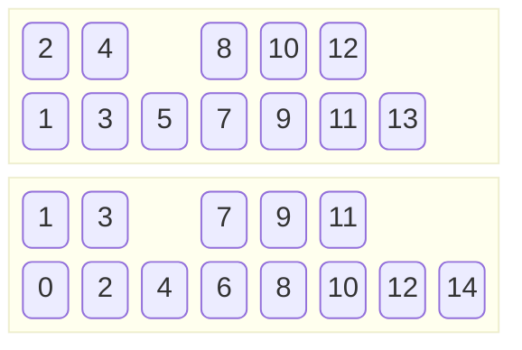
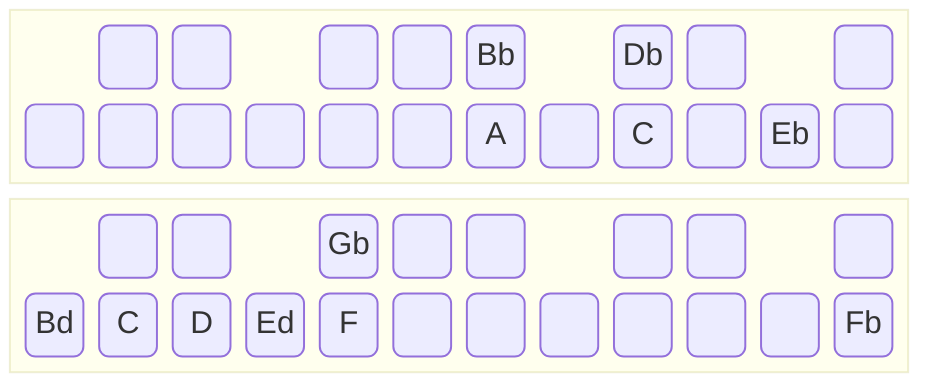

# 9ed3/2

**9ed3/2** or **78.00c** or **Carlos's Alpha Scale** is noteable for lacking an octave (>30c off).
It has a perfect fifth by defintion, and approximate 6/5 and 5/4 well.
As a consequence the minor and major 7ths are also well approximated.
Fourths are poorly approximated (>30c off).

14 steps make 1091.93c.

## Maqam Saba

No octaves is no problem in maqam saba.
Below is a suggestion for how to play maqam saba in D.
It can also be interpreted as maqam bastanikar.

Note that the minor 3rds are 6/5 rather than Pythagorean minor 3rds more common in maqam saba.
Jins sikah is an evenly divided 6/5.
Jins hijaz has very flat 2nds and a very flat perfect 4th, so, it is more jins hijaz gharib than a normal jins hijaz.
Jins 'ajam and jins rast are undifferentiatied, but given that the perfect 4th is either very flat or very sharp, a distinction to jins jiharkah can be made by using the flatter 4th for the latter.

